# Introduction
The human brain is on average 1.5kg and has 1.2l volume. This is large, but by fare not the largest brain compared to other animals.

The main function of the [Brain] is to receive stimuli from the environment, encode it, do sensory integration and finally decode to make movements, actions and decisions. 

## How is information processed in the brain?
Information processing can be viewed at on many levels, from the highest to the lowest level:

Behaviour -> System and Pathways -> Circuits -> [Neurons] -> Microcircuits -> [Synapses] -> Membrane Potential

In a way we can compare a brain to a computer, but there are also some significant differences:

| Similar               | Different                           |
| --------------------- | ----------------------------------- |
| process information   | massive parallelism                 |
| logical operations    | separation of memory and processing |
| memory                | constantly adapting                 |
| uses digital signals  | chemical signaling                  |
| can learn from inputs | unreliable units                    |
| consumes energy       | analog computation                  |
| ...                   | robust to damage                    |
|                       | very energy efficient               |
|                       | ...                                 |

<sup><sub>Under different we listed things that the brain has / can do but a computer doesn't.</sub></sup>

Things that are easy to us humans can be hard to a computer, mostly because we don't know how to simulate a brain. And we don't know precisely how we do things - we can do things without consciously thinking about them.

- It is relatively easy to program a computer to play chess better than a human
- We have the neuron diagram of a worm, but we still have know idea how it works

## Other facts

- WindowsXP contains more code (1.5 Gb) than human DNA (750 Mb)
- An 83000-Processor supercomputer can only match 1% of the human brain
- Deep Neural Networks were inspired by the brain at the start, but it is not how the brain works.


# Nervous System

The human nervous system consists of two part:

- Central nervous system (CNS) - [Brain] and spinal cord
- Peripheral nervous system (PNS)

The peripheral nervous system can be subdivided into somatic and automatic NS. Where the automatic NS again can be divided into sympathetic NS (fight and flight reactions) and parasympathetic NS (rest and digest).

The cranial nerves are the gate between the sensory periphery and our brain. They emerge directly from our brain and connect it to our primary senses (taste, smell, etc.). 


# Brain
The brain is the main part of the CNS, it is protected by the skull and the meninges. When studying brains, scientists often use mouse brains (70 million [Neurons]) instead of human brains.

## Anatomy
When comparing brain weight to body weight across different species, we can see a clear correlation.

### Navigating the CNS
When talking about the CNS, we saw many different definitions of orientation. The main ones are the coronal (front), sagittal (side) and the horizontal plane cut. Further definitions can be seen in the following graphic:

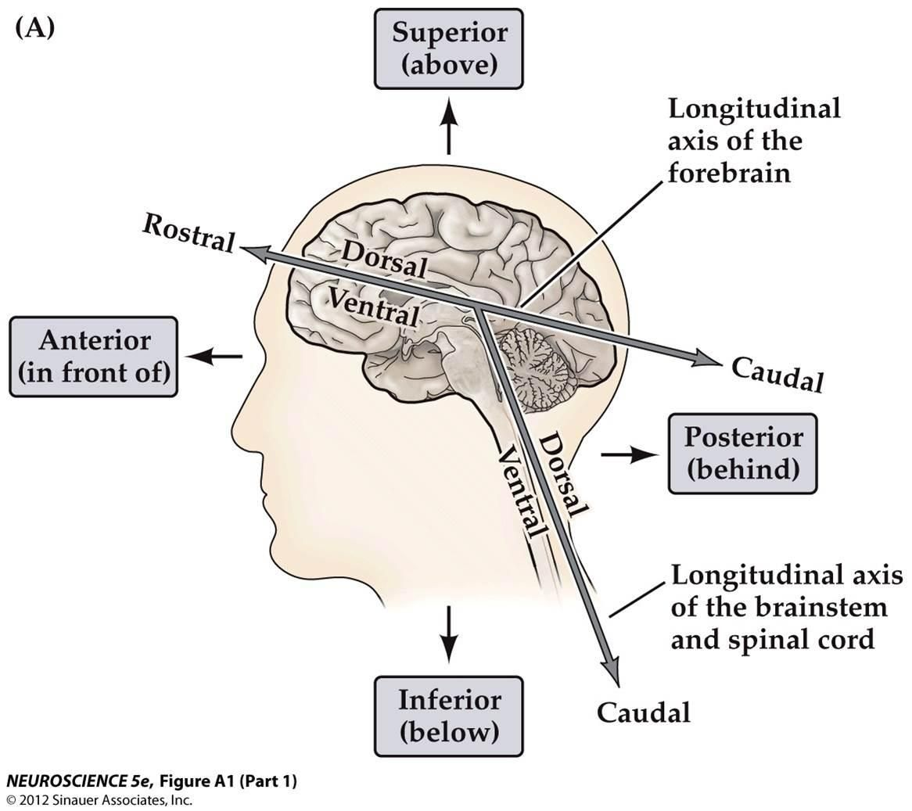{width=400px}

### Skull
The skull is a hard, protective layer around most parts of our brain. It consists of 32 bones and provides fixed points for our senses (eyes, ears, etc.).

### Meninges
The meninges is a protective layer between the skull and the brain. It consists of three membranes (inwards):

- dura mater - thick layer that gives physical protection
- arachnoid mater - cushion like layer that is fluid resistant
- pia mater - soft tissue that follows the brain structure and is also fluid resistant, so the cerebral spinal fluid can't leak out.

They are known for protecting the brain against infections.

### Ventricular System
The brain has four main cavities filled with Cerebral Spinal Fluid (CSF), we call them the ventricles. This CSF makes the brain float, so the brain does not touch the bones and thereby damages itself. Further it provides nutrition and an ionic environment for the brain. 

### Major divisions of the brain

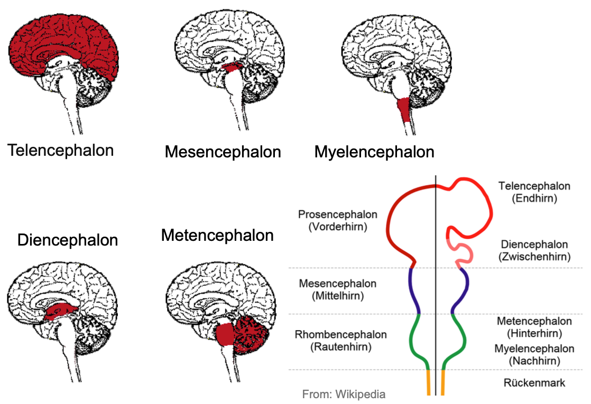{width=400px}

The telencephalon (or cerebrum) is the part we are most interested in. This is also one of the key features of human brains, that the telencephalon is really large.

We will especially look at part of the telencephalon and the diencephalon.

### Cerebral Cortex (telencephalon)
There are four lobes in each hemisphere, they are separated by fissures in the cortex.
The cerebral cortex is the outer layer of neural tissue of the telencephalon. It mostly consists of the six-layered **neocortex**. We can differentiate different areas of the cortex and associate them with different functions (there are 52 areas). We call connections from the deep layers to the superficial layers **feedback connections** and **feedforward connections** the other way around.

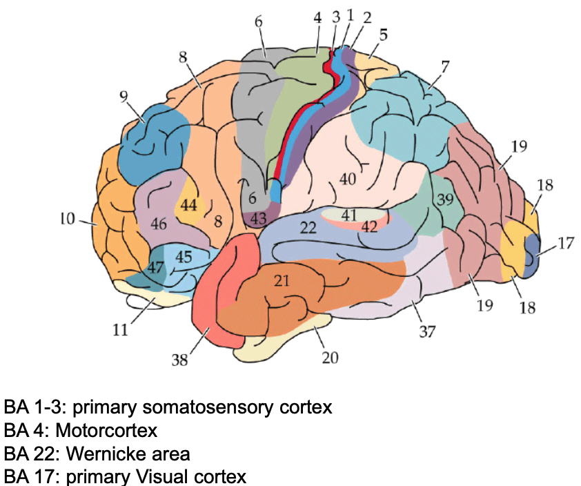{width=400px}

### Neocortex (telencephalon)
Has six layers, that are not of uniform depth around the brain. The deeper we go the more cell bodies we encounter. The deepest layer contains white matter. 

### Basal ganglia (telencephalon)
Is involved in movement actions, it triggers movements but not the fine movement control. Regulates voluntary movements. Movement disorders like Parkinson's originate from here.

### Limbic system (telencephalon)
The limbic system is part of the brain that is involved in the emotional expression and memory acquisition. Especially parts like the amygdala are connected to special emotions, in this case fear. 

### Thalamus (diencephalon)
Entryway to the cortex, most signals are transmitted through the thalamus. It works as a relay station.

### Hypothalamus (diencephalon)
Below the thalamus, connects the [Nervous System] to the hormone system. Controls the pituitary gland, responsible for hunger, body temperature, etc.

### Cerebellum (metencaphalon)
"Little brain", coordinates motor behaviour, posture adjustments and stores memories for simple learned motor responses.

### White matter and grey matter
The white matter mostly consists of myelinated axons and is used to connect the brain (areas of grey matter). The myelin acts as an insulator and allows signals to propagate faster. 

Grey matter on the other hand consists mostly of neurons with dendrites and unmyelinated axons. This is where the actual processing happens.

## Development 

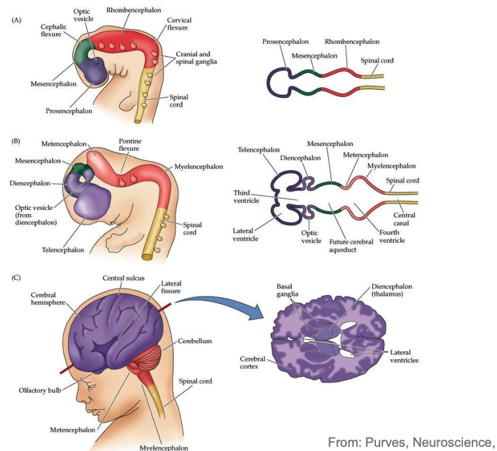{width=600px}


# Neurons
Cells that make up the [Brain]. These are very similar between different species. Certain types of neurons occur in specific parts of the brain, this is consistent between species. A neuron can be thought of as a processing unit that receives electrical input (dendrites) and generates electrical output (axon). Communication between neurons happen through [Synapses], in a directed way (pre -> post). This can cause a long effect called learning through spikes or acrion potential.

There are over 100 types of neurons. We looked at two ways of classifying them:

- morphology: how the look
- electrophysiological profile: how they work

## Anatomy
There might be a lot of different types of neurons, but the all consist of the same parts:

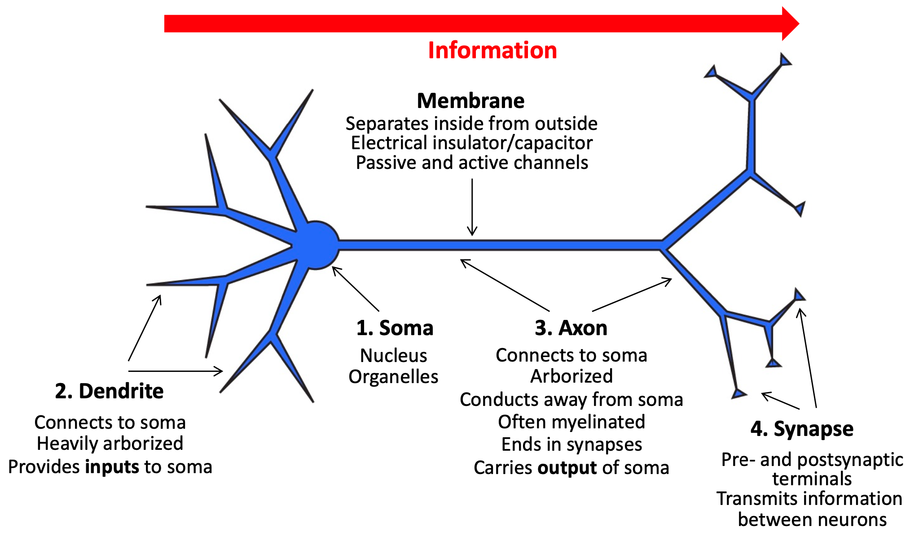{width=400px}

- membrane - separating inside from outside
- soma - cell body, contains nucleus and organelles
- dendrites - connect to soma and provide inputs
- axons - connect to soma and conducts away from it, often myelinated and end in synapses, carry output
- [Synapses] - pre / post synaptic terminals, transmit information between neurons (about 10'000 per neuron)

### Dendrites
Dendrites can be seen as the input of the neuron. The electrical signal arrives at the dendrite. Can connect to many different synapses.

### Soma
Cell body of the neuron. Here the electrical signal from the dendrites arrive and are "added up". If the activation threshold is reached, another electrical signal is sent through the axon.

### Axon
Works like a cable to transfer the electrical signal from the soma to the synapse. Since normally the this transfer would take a long time, nature has developed a solution, the myelin sheet surrounding the axon (this sheet makes the white matter white). 

### Synapse
At the synapse the electrical signal, coming from the soma via the axon, gets translated into a chemical signal. 
When a signal arrives at the synapse, vesicles release neurotransmitter into the synaptic cleft. At the other side the post-synaptic receptors receive these transmitters and react. 
We can differentiate between excitatory and inhibitory transmitter. One type of neuron only releases one of these types.

Inhibitory -> ion channels open and let negatively charges ions in
Excitatory -> ion channels open and let positively charged ions in

## Single neuron computations
Neurons are complex structures, therefore it can get really complicated to simulate them. Therefore we can have different levels of abstraction. Clearly as we simplify our model, we loose some details that can have an effect on the larger system. (e.g. back propagation in dendrites)

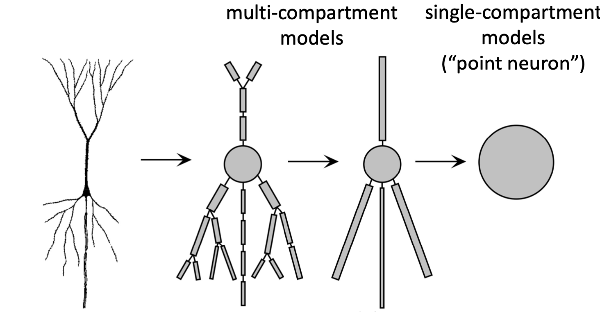{width=400px}

## Resting potentials
The **resting potential** exists due to the differences in membrane
permeabilities for potassium, sodium, calcium, and chloride ions, which in
turn result from functional activity of various ion channels, ion transporters,
and exchangers. Conventionally, resting membrane potential can be defined
as a relatively stable, ground value of transmembrane voltage in cells.

Normally the inside is about $-70mV$, while the outside is $0mV$.

### Basic components
First we need to introduce some basic components:

1. The **cell membrane**, works as a barrier and an electrical insulator between the outside and inside of the cell. The membrane contains **ionic pumps** that can move ions from one side to the other.
2. Due to the ionic pumps we achieve a **concentration gradient**, some ions are more common in the inside while others are more common on the outside.
3. Additionally we have **ionic channels** that selectively let ions through the membrane. We differentiate between active and passive channels. Passive channels are always open, while active channels can be controlled.

>Remember that the concentration wants to reach an equilibrium state! We call this **diffusion**.

The ions we looked at are:

- $K^+$ (Potassium), 
- $Ca^{2+}$ (Calcium), 
- $Cl^-$ (Chlorid), 
- $Na^+$ (Sodium).

The **resting potential** is given by the passive ion channels.

### Nernst equation 
We want to try and describe this potential difference with equations. We simplify this by looking at a single ion type, we choose potassium as it is the most common.

#### Ionic Flux
First we introduce the ionic flux and get an equation for the equilibrium $(Flux_{out \rightarrow in} = Flux_{in \rightarrow out})$:
$$Flux_{out \rightarrow in} = \gamma[K^+]_{out}$$
$$Flux_{in \rightarrow out} = \gamma [K^+]_{in} \cdot p (E_{kinetic} > |qV_{eq}|)$$
where we have the following factors:

- $p(...) =$ probability for an ions to fulfil the condition
- $\gamma =$ fraction of ions getting to channel entrances
- $q=$ elementary charge $1.6 \cdot 10^{-19}$ Coulombs
- $E_{kinetic} =$ kinetic energy (thermal motion)

#### The Boltzmann factor
$$p (E_{kinetic} > |qV_{eq}|) = e^{\frac{qV_{eq}}{k_BT}} = e^{\frac{-E}{k_BT}}$$
With the following factors:

- $E =$ Energy
- $k_B =$ Boltzmann constant
- $T =$ Temperature

#### The Nernst equation
Combining these two we end up with the following equation for the resting potential with a single ion type:
$$V_{eq} = \frac{k_B T}{zq} \ln \Big( \frac{[X]_{out}} {[X]_{in}} \Big)$$
Where $z =$ ionic charge (signed).

### Reversal potential
The **reversal potential** of an ion is the membrane potential at which there is no net flow of that particular ion from one side of the membrane to the other. In a single ion system it is synonymous with the equilibrium potential. We can describe this with a graph, where $V_{eq}$ is the reversal potential and $E_K$ is the equilibrium potential of a single ion type (Figure 7).

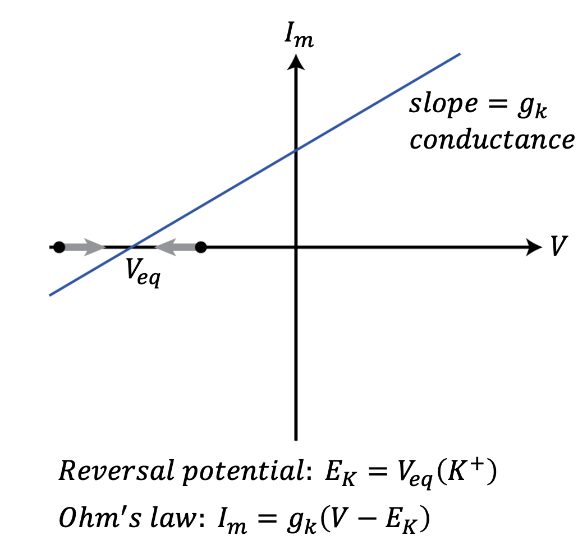{width=400px}

Each channel type will have a different reversal potential. Assuming we now have two different channel types (i.e. different ion types). We can draw the reversal potential of both channel types and end up with the following graph (Figure 8).

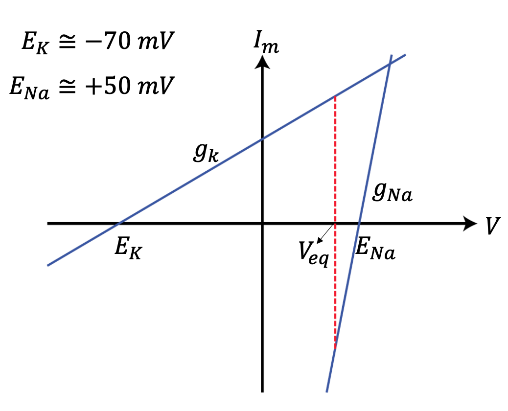{width=400px}

The resting potential now is in between the reversal potential of the two channels.

### Goldman-Hodgkin-Katz Equation
We now generalise this equation for channels that is accessible to multiple ion types:
$$V_{eq} = \frac{k_B T}{q} \ln \Big( \frac{P_K [K]_{out} + P_{Na} [Na]_{out} + P_{Cl} [Cl]_{in}} {P_{K}[K]_{in} + P_{Na}[Na]_{in} + P_{Cl}[Cl]_{out}} \Big)$$
where $P_X$ stands for the permeability of $X$. 

## Passive membrane
The inside of the neuron is separated from the outside by the membrane. When an electrical potential travels along the dendrites, we encounter so called leak current. This means that the electrical potential gets smaller the longer it has to travel as current escapes through the membrane. This phenomenon can be described by the cable equation. But before we get to that we first start with a simpler model, the so called **single-compartment model** of a neuron.

### Single-compartment model

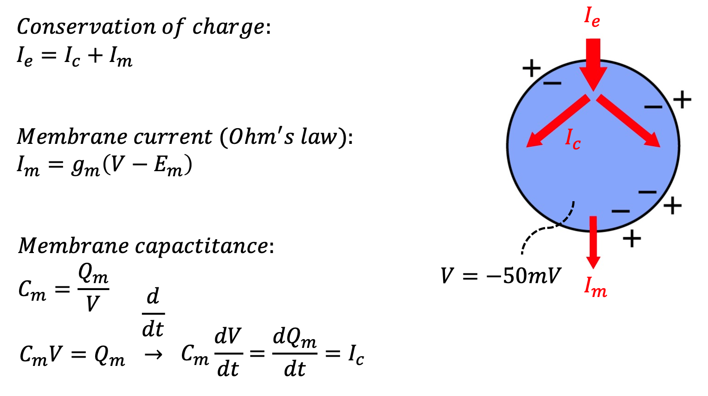{width=400px}

We end up with the following expression:
$$R_m I_e - (V - E_m) = \tau_m \frac{dV}{dt}$$
where $R_m = \frac{1}{g_m}$ is the input resistance and $\tau_m = R_m C_m$ is the membrane time constant. We can now use this equation to derive a **steady-state solution** (steady input current):
$$V_\infty = R_m I_e + E_m$$
We can now make some interesting observations, that are nicely summaries by Figure 10.

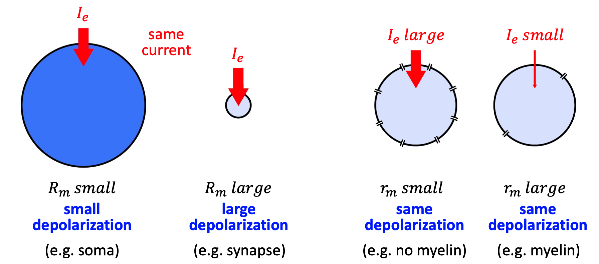{width=400px}

#### General solution
$$V(t) = V_\infty + (V(0) - V_\infty) \cdot e^\frac{-t}{\tau_m}$$
This equation describes $V$ over time, when plotting the graph we see that $V$ asymptotically gets closer to $V_\infty$ as time progresses. When looking at $\tau_m \approx 10 - 100$ms we have the following implications:

- time-scale of change in the cell is slow compared to computers
- activity gets forgotten after $\tau_m$ 
- for longer memory we need other mechanisms (e.g. plasticity)

#### Spatial and temporal summation
For a neuron to reach its activation threshold we need a certain amount of current. Looking at this equation, we can see that we have two ways of getting to this threshold:

- **Spatial summation**: multiple, simultaneous inputs adding up
- **Temporal summation**: multiple, time-delayed inputs adding up

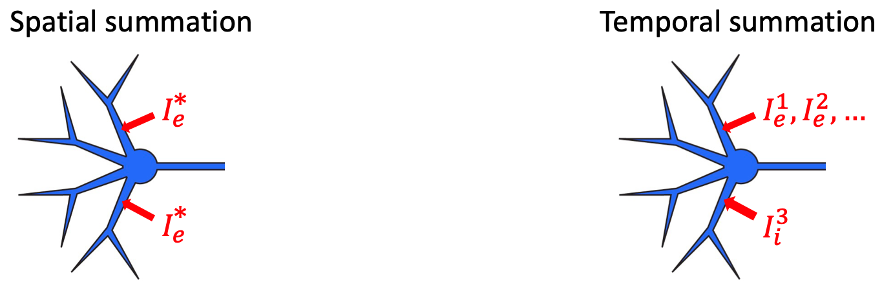{width=400px}

### Cable equation
Now we want to describe the same thing but we have to take into consideration the length / area of the dendrite. For this we use the cable equation:
$$c_m \frac{\partial}{\partial x} V = \frac{1}{2ar_L} \frac{\partial}{\partial x}\Big(a^2 \frac{\partial}{\partial x} V \Big) - i_m + i_e$$
This is a very complicated equation, for example the radius $a$ does not need to be a constant.  We want to simplify this. Assuming $a$ is constant, $v = V - E_m$ and $i_m = \frac{v}{r_m}$ (leak current), we get the linear cable equation (that we can solve analytically):
$$c_m \frac{\partial}{\partial t} v = \frac{a}{2r_L} \frac{\partial^2}{\partial x^2}v - \frac{v}{r_m} + i_e$$
We then looked at some results of the cable equation:

- ***Case 1***: *Infinite cable & constant current* - $V(x)$ decays exponentially with distance
- ***Case 2***: *Infinite cable & pulse current* - at each time $t$, $V(x,t)$ is a Gaussian

### Result
The input at the dendrite can be very large, but the fraction that reaches the soma is small. We showed that ***injecting the current into the soma directly does not make a very large difference***, as dendrites are very efficient. In total we need about **~25 inputs for a neuron to fire**.

## Action Potential
In the previous sections we have seen how inputs reach the soma. When a series of input triggers a neuron to fire, we will see an action potential propagate along the axon to the synapses. This is what we want to look at now.
Axons can be very long and therefore we need an effective way to transport this signal to the pre-synaptic terminals.

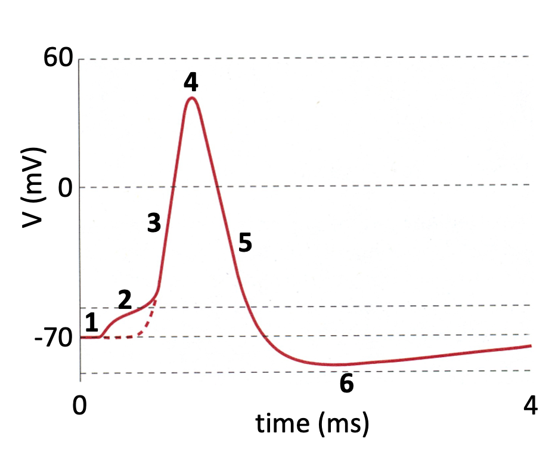{width=400px}

This diagram shows an action potential. This last only 1-2ms and is an all-or-none signal. There are several phases:

1. No input, neuron is at resting potential
2. Current $I_E \Rightarrow V - V_\infty \sim \exp(-t/\tau)$  
3. $V \Rightarrow$ rapid increase in $V$
4. Peak @ $V > 0$
5. Rapid decrease in $V$
6. Undershoot: $V < V_{rest}$

The axon contains some special **voltage-dependent channels**, they change the conductance. This gives the axon its special properties.

### Voltage Clamp Experiment
These channel where found by Hodgkin and Huxley in the voltage clamp experiment. This is a technique invented by Hodgkin and Huxley to measure the current $I$ at a set voltage $V$.

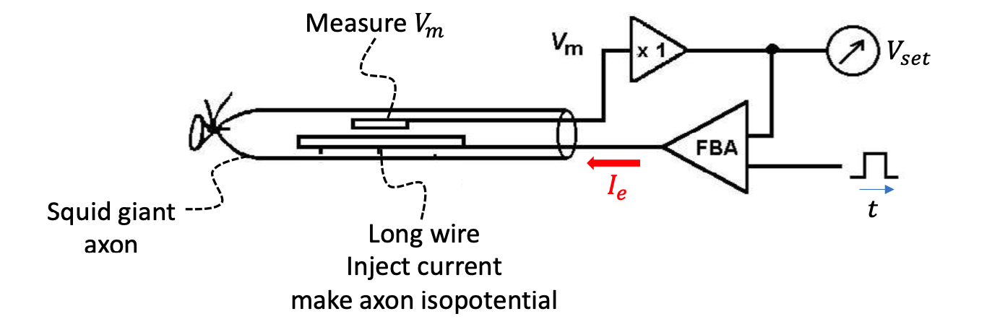{width=400px}

For the experiment to work, they needed to inject a voltage $V_{set}$, further they injected a current $I_L$ to compensate for the leak current and a current $L_C$ to depolarize the membrane at the start and repolarize it at the end. 

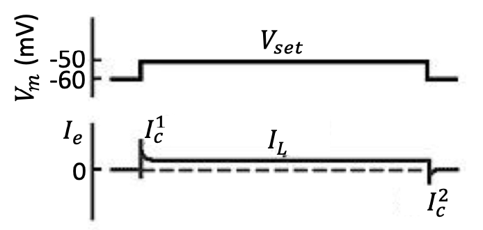{width=300px}

They found that when setting a higher initial $I_C$, the axon first wants to depolarize and then hyperpolarize, meaning that we need to inject a lot more current than $I_L$ to keep the voltage at $V_{set}$. 
From this they hypothesised the existence of these channels and later confirmed it with similar experiments.

### Conductance
With Ohm's law we are able to obtain the conductance $g_{Na}(v,t)$ & $g_K(V,t)$. 

- $g_{Na}$ has fast activation and fast inactivation
- $g_K$ hast slow activation and no inactivation

This explain what Hodgkin and Huxley observed in their voltage clamp experiment.

Today we now that these channels are either open or closed, proven by the patch clamp experiment. As the action potential moves across the membrane, we see channels opening and closing.

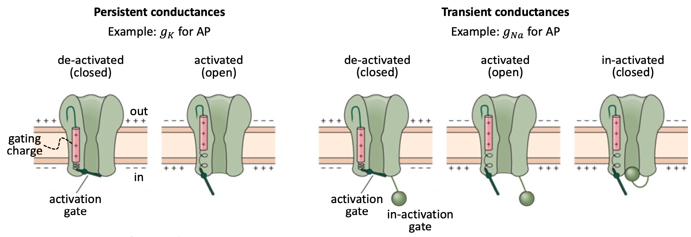{width=400px}

### Hodgkin and Huxley Model
The following model accurately models these channels:

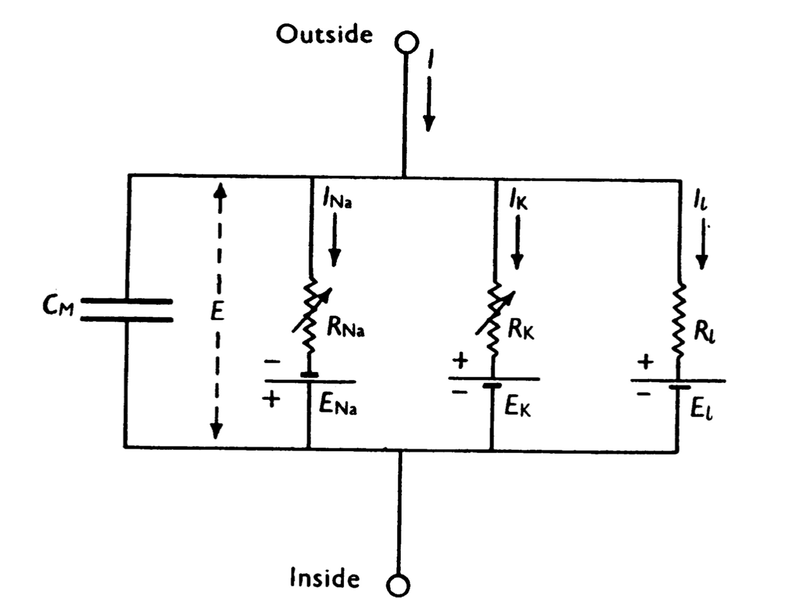{width=400px}

### Starting an action potential
These experiments showed that the action potential works with a positive feedback loop. At the resting potential we have $I_L$ & $I_K$ > $I_{Na}$ therefore we have no action potential. But when we start an action potential we will have $I_L + I_K = I_{Na}$ resulting in this the generation of an action potential.

This was all for unmyelinated axons. If we have myelinated axons, this process will happen at the nodes of ranvier, resulting in faster action potential propagation, smaller currents and faster $v_{AP}$ increase with radius. Making them better for longer distances.

Why does this only happen in axons?  - These channels are only present in sufficient amount in the axons.

### The Big Picture

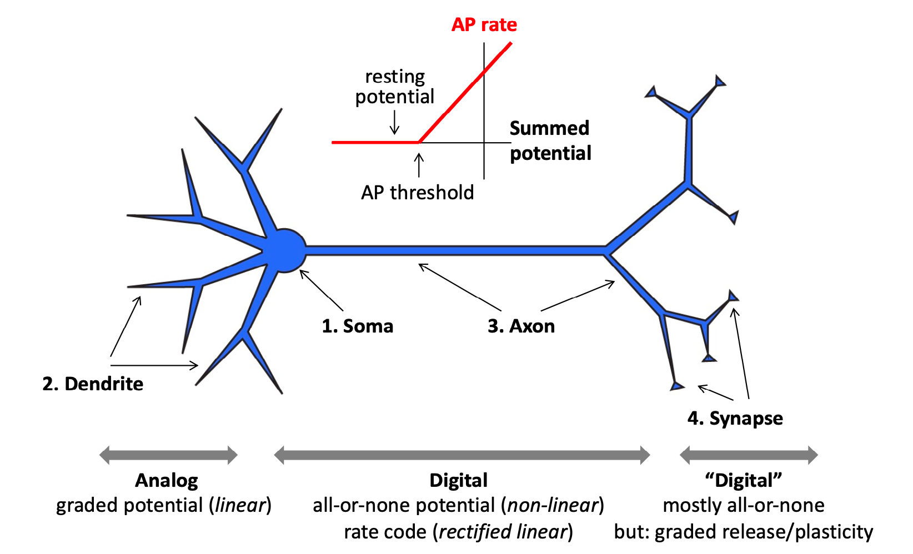{width=400px}


# Synapses
Synapses are the connection between [Neurons]. They convert the electrical signal (action potential) coming from the axons into a **chemical signal** (neurotransmitter), that is transported to the next neuron, where it again is converted into an electrical signal (excitatory or inhibitory). 

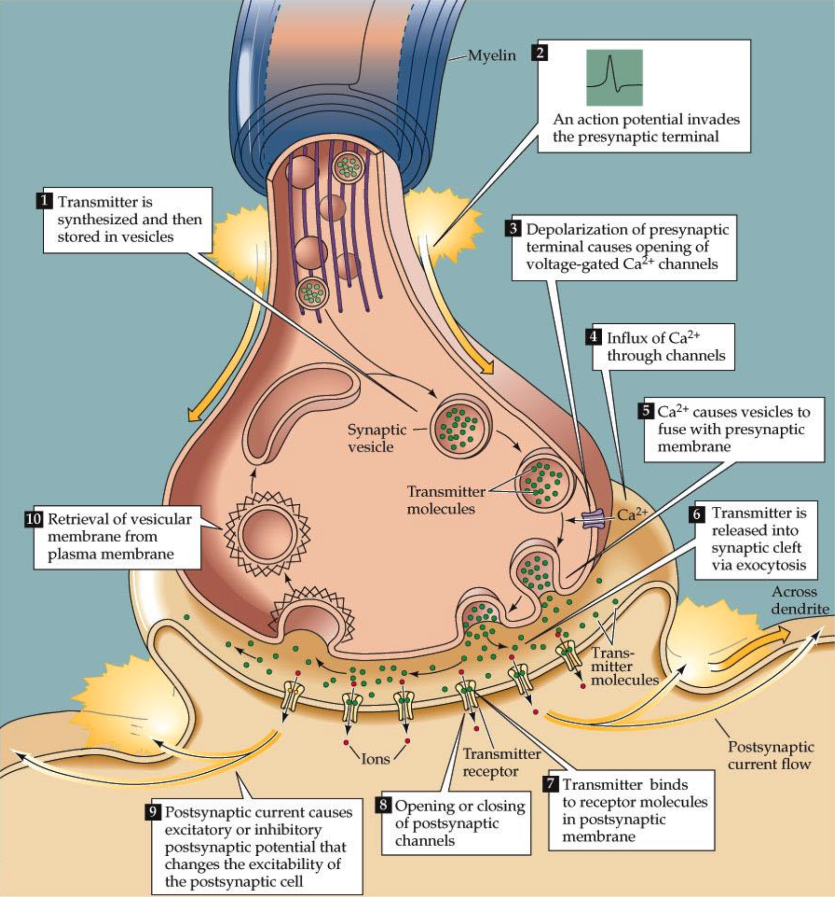{width=500px}

Contrary to electrical transmission multiple steps are required to release transmitter chemicals and for them to act on postsynaptic receptors, resulting in a ***time delay*** (can be as short as 0.2ms, from Ca2+ entry to secretion). Synapses are ***highly modulatable*** as it involves many different steps at the presynaptic / postsynaptic terminal.

Synapses do not always connect to dendrites, they may also connect to other axons or the the soma of another cell.

>Synapses are not reliable, sometimes they may not transmit a signal or they might spontaneously transmit. 

## Steps to chemical synaptic transmission

- reaching of activation threshold of the presynaptic neuron
- conduct down the axon
- opening of voltage gated Ca channels
- diffusion and action of Ca2+ at release site
- exocytosis and diffusion of neurotransmitter in the synaptic cleft
- activation of postsynaptic receptors

Notice that the calcium influx is sufficient for the release of neurotransmitter.

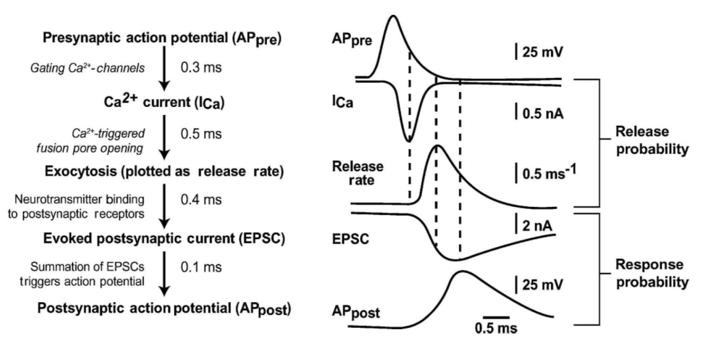{width=400px}

## Neurotransmitter
Neurotransmitter are **small molecules or peptides** released by the Ca2+ dependent depolarization at the presynaptic terminal. 
The mechanisms and sites of synthesis are different for the two types of neurotransmitters:

- small molecule transmitters are synthesized at terminals, packaged into small clear-core vesicles
- peptides, or neuropeptides are synthesized in the endoplasmic reticulum and transported to the synapse, sometimes they are processed along the way. Neuropeptides are packaged in large dense-core vesicles

Notice that neurotransmitter are always released in discrete packages / quanta, depending on the vesicles. 
The number of readily releasable vesicles a synapse has available is variable. A consequence of having a limited number is depletion at high stimulus frequency.

## Standard Katz (Quantal) Model of Synaptic Transmission

- One packet of neurotransmitter = 1 quantum
- action potential transiently increases in the probability of releasing nx quanta
- several quanta are available to be released
- each quanta approximately gives the same postsynaptic response
- average number of quanta released = (number of quanta available) x (average release probability)

Quantal release follows a binomial distribution.

## Synaptic release cycle

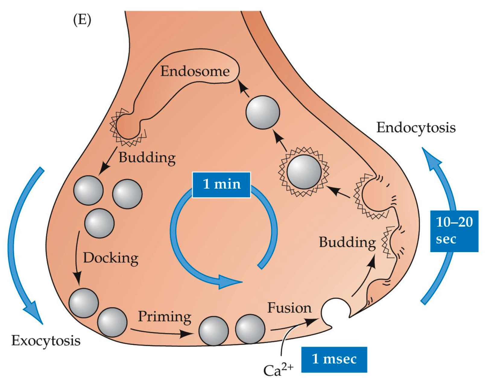{width=400px}

The synaptic vesicle release consists of three principle steps:

- Docking - Docked vesicles lie close to plasma membrane (within 30 nm)
- Priming - Primed vesicles can be induced to fuse with the plasma membrane by sustained depolarization, high K+, elevated Ca++, hypertonic sucrose treatment
- Fusion - Vesicles fuse with the plasma membrane to release transmitter. Physiologically this occurs near calcium channels.

### Priming
Vesicles in the reserve pool undergo priming to enter the readily-releasable pool. Priming corresponds to the assembly of the SNARE complex.

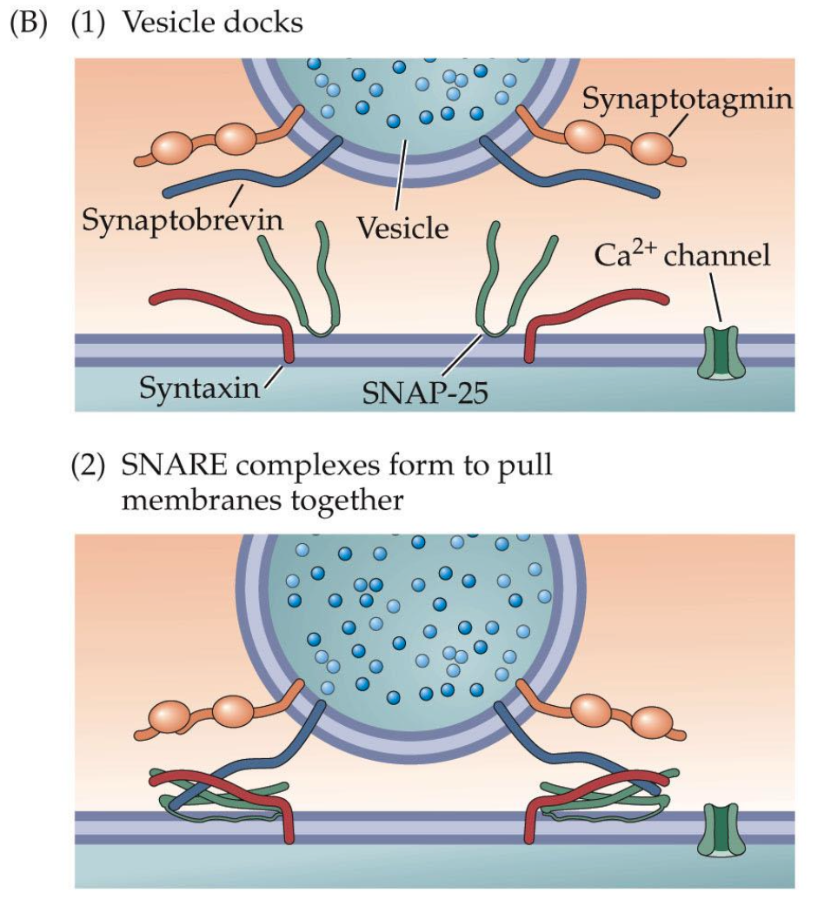{width=300px}

## Postsynaptic Receptors
When neurotransmitter cross the synaptic-cleft, they can bind to two types of receptors:

- Ionotropic (LGIC)
- Metabotropic  (GPCR)

### Ionotropic
Contains a transmitter binding site, after coupling the closed ion channels opens. Contributes to fast changes in the membrane potential.

### Metabotropic
Here a secondary messenger is involved. After the transmitter is coupled to the receptor a G-protein (messenger) is released. This G-protein is then responsible for signaling the ion channel to open. This process is much slower.

#### NMDA Receptor
NMDA receptors are one of the most important metabotropic receptors. They play a very important role in synaptic plasticity. NMDA receptors are excitatory, glutamate receptors.

## Electrical synapses
Until now we have discussed only chemical synapses, but there are also electrical synapses! 

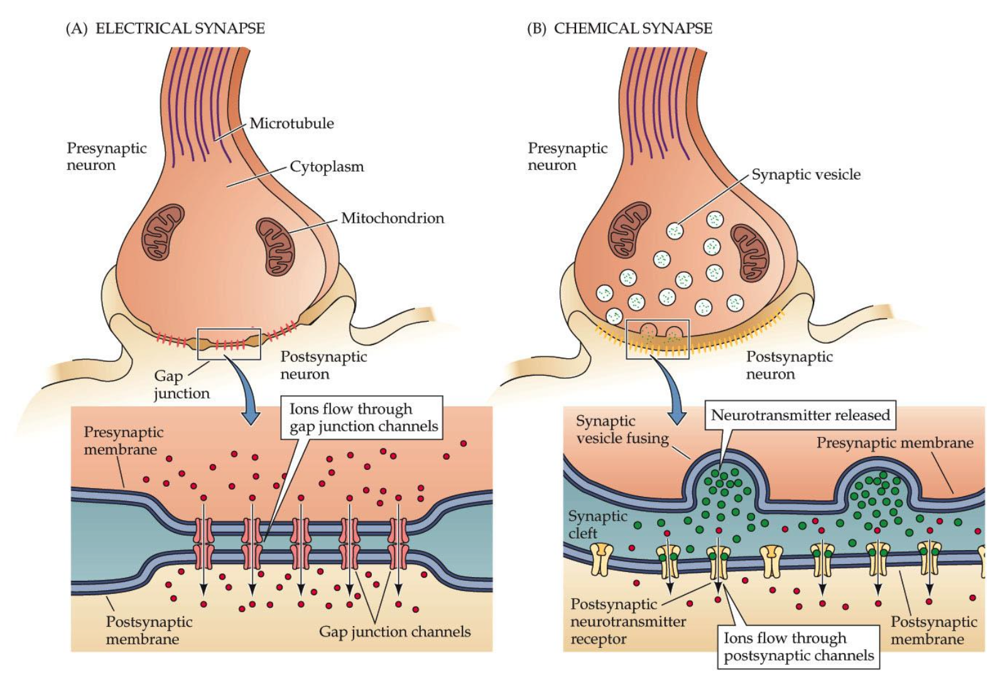{width=500px}

These synapses are bidirectional. Here the synapses are much closer to each other than in chemical synapses. An advantage of electrical synapses is, that they are much faster.

| Electrical Synapse                    | Chemical Synapse                             |
| ------------------------------------- | -------------------------------------------- |
| simple primitive system               | highly developed structure                   |
| often symmetrical / bidirectional     | polarized, structurally and functionally     |
| gap junction                          | pre: active zone, post: postsynaptic density |
| very fast, no synaptic delay          | slower, synaptic delay (~0.5ms)              |
| Ca2+ independent                      | transmitter release requires Ca2+ influx     |
| temperature-insensitive               | temperature-sensitive                        |
| large synapses                        | thousands of small synapses                  |
| limited functions, usually excitatory | versatile, excitatory and inhibitory         |
| synchronized activity                 | point to point communication                 |

## Plasticity
>**Hebb's law:** Neurons that fire together wire together

# The Neural Code
We want to have a look at how information is encoded in the brain. When considering a code, it is important to think about three elements:

- Correspondence - a code is a correspondence between two domains, e.g. visual signals and spike trains
- Representation - how is a code represented
- Causality - a code needs to be a causal relation

We want to learn how to encode a stimulus - how does the pattern of response look like - and how to decode - what does the response tell us about the stimulus.

To understand neuronal responses, one often measures neuronal activity, depending on a parameter of the stimulus. Example:

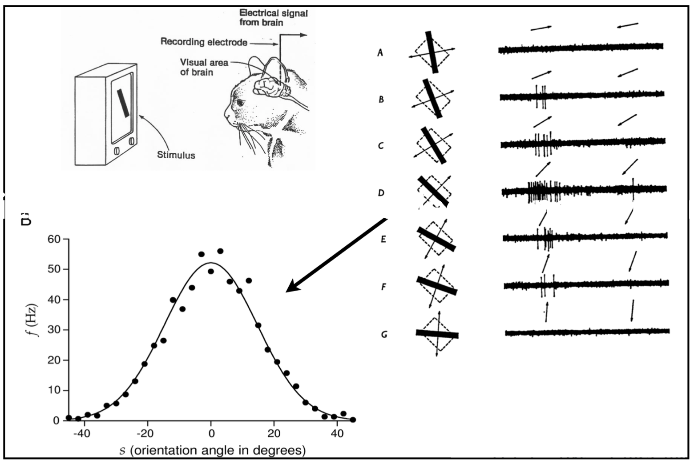{width=400px}

We have seen many different examples of encoding, one of the most interesting ones was about the encoding of space via hippocampal place cells in rats. [Video of Spacial Encoding](https://www.youtube.com/watch?v=lfNVv0A8QvI&feature=emb_title)

What one can see here is how different neurons are active, when the rat is in a specific position.

## Rate Code vs Temporal Code
**Rate coding** refers to information being carried by the firing rate. It is often argues that ***firing rate captures essentially all relevant information***.

**Temporal coding** on the other hand may refer to several quite different ideas: 

1. much of the information may be transmitted by a neuron during certain small intervals of time (phase)
2. synchronous, or what one could call quasi-synchronous, firing of neurons within and across ensembles may carry important information (synchrony)
3. the precise timing, or pattern, of spikes may carry information (time to first spike)

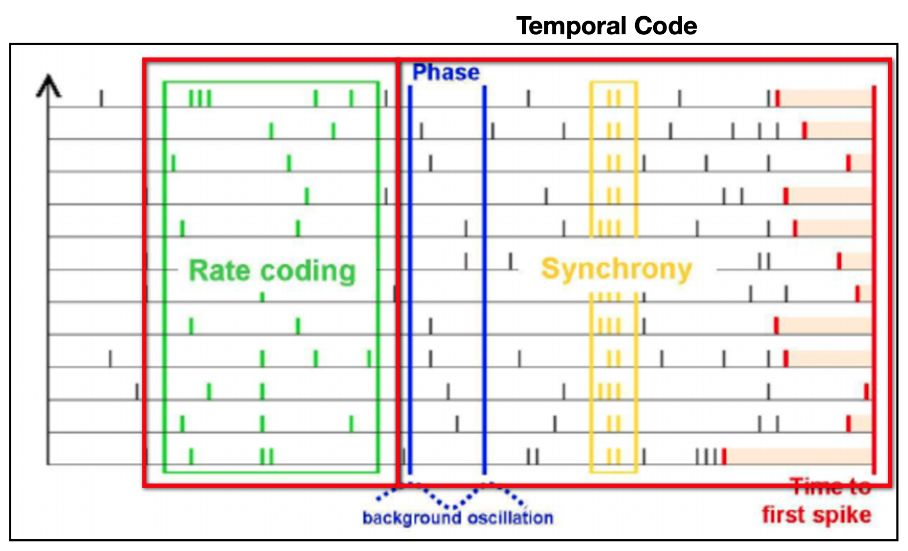{width=400px}

Often information that one sees in one encoding, can also be seen in the other encoding.

## How to investigate the stimulus encoding
We want to find out how we can model a relation of the stimulus to the firing rate of a neuron.

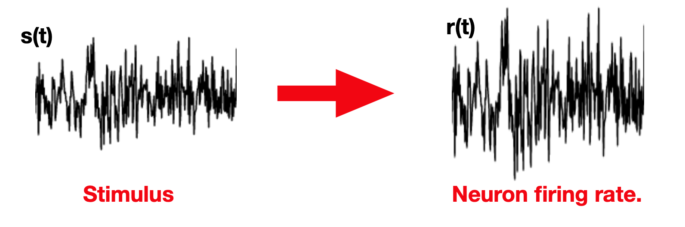{width=400px}

We have to consider that there are many factors like noise or recurrent / network effects, that make it almost impossible to find an accurate relation.

### Linear Temporal Filter
The simplest possible relation is a so called linear temporal filter given by the convolution of $s$ and $f$:
$$r(t) = (s \ast f)_t =\sum_{k = 0}^n s_{t-k}f_k$$
Examples:

- running average filter - average over last n time points
- leaky average filter - average over last n time points where recent time points are weighted more

### Linear Spatial Filter
Another possible relation is a linear spatial filter (e.g. visual signals):
$$r(t) = \sum_{x' = 0, y'=0}^n s_{x-x', y-y'} f_{x', y'}$$
Clearly we can combine these two types of filters into one.

### Nonlinearity
We have some problems, spike rates can't be negative, spike rates can't increase indefinitely, etc. Therefore we have to combine this linear filter with a sigmoid function.

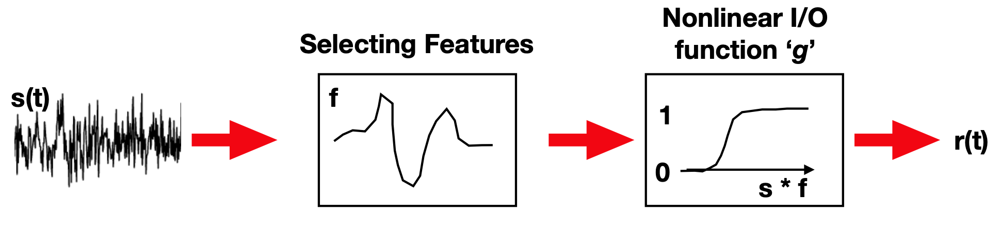{width=400px}

## Population Activity
Normally this linear filter and nonlinear sigmoid function are not known. We only know the high-dimensional data that results in a low-dimensional neuronal firing. We therefore are interested in how a whole population of neurons behave. (Nowadays a single probe can record the activity of up to 1'000'000 neurons)

>Population coding refers to information available from an ensemble of neurons.

### Finding the mean population response vector
We measure the spiking activity given by combination of features. In the diagram, we plot a stimulus as blue if it causes a spike and red if it doesn't.

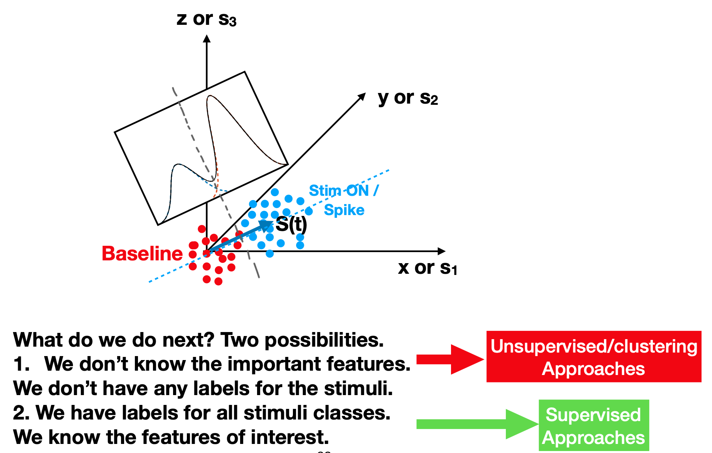{width=400px}

The blue vector is then the so called response vector, it connects the mean of the baseline with the mean of the spike cluster. With this we can project a stimuli in the direction of neuronal response and determine if it will cause a spike or not, depending on with side of the decision boundary it lies.

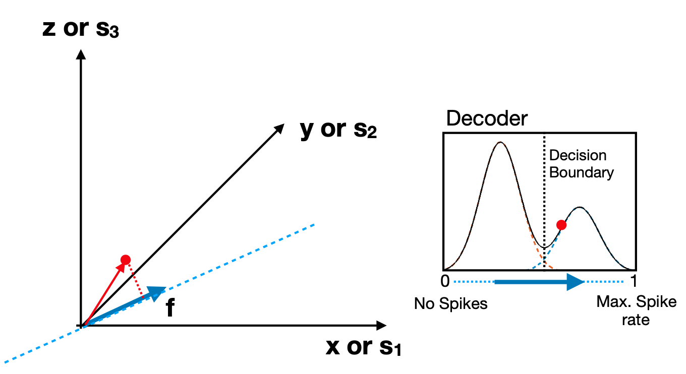{width=400px}

### Finding the I/O function
The I/O function is given by:
$$P(\text{spike} | \text{stimulus}) = P(\text{spike}|s_1)$$
which can be found from data using the Bayes rule. If the probability of a stimulus is the same as the probability of a stimulus given a spike, we can say that they are unrelated. If however these are not the same, we found a criteria for the I/O function.

### Population Distance Metrics
Given multiple neurons: 

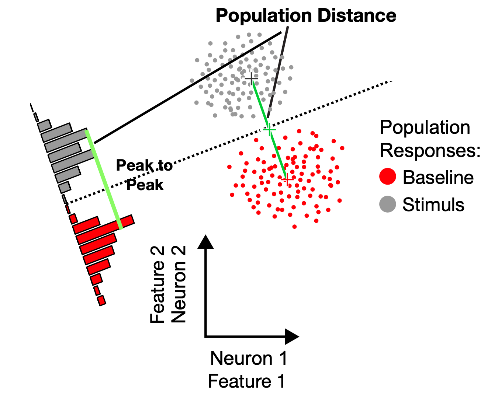{width=400px}

{width=400px}


# Learning and Plasticity
Connection in the human brain are mostly learned, it would be almost impossible to encode all these connections in our DNA. This is important, since it has been shown that with learning one achieves better performance compared to having it encoded in our DNA. Learning is the source where intelligent behaviour emerges.

## Defining learning / plasticity
**Learning** it the acquisition / storage of knowledge or the formation of a memory through experience.

**Memory** is stored information that can be recalled at a later stage.

**Plasticity** is the biological implementation of learning, it allows us to form a memory.

In neuroscience we differentiate different types of learning:

- Pavlovian Conditioning
- Instrumental Conditioning
- Reward / Aversive Learning
- Social Learning
- Perceptual Learning
- Motor Learning

There are also many ways to categorize types of memory, e.g. emotions, motor skills, language, etc. Psychological we can put them into two categories:

- explicit (declarative) - facts, events
- implicit (nondeclarative) - priming, skills, emotional responses

### Timescales of Neuronal Plasticity

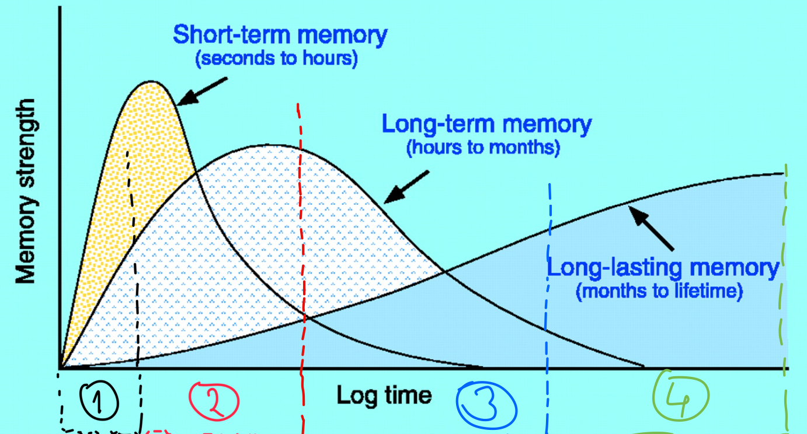{width=400px}

Memory is not fixed to a location in the brain. As memories go from short-term to long-term, they change the location.

## Substrates of Plasticity
This part is about how learning happens in the brain, starting at a high level and going down to a lower level.

On the highest level, the brain uses the hippocampus to learn explicit knowledge. While the hippocampus does not store this longterm memory, it is needed to form it. 

{width=400px}

### Perceptron Learning
On a cellular level, we need to talk about perceptron learning. This is also important for training deep neural networks. A neuron implementing perceptron learning is called a **Perceptron** or a **[McCulloch-Pitts Neuron]**.

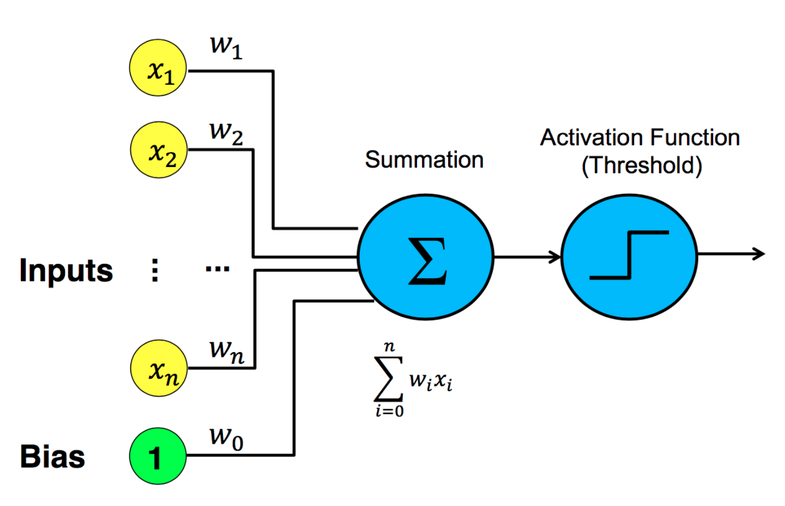{width=400px}

A Perceptron can implement a ***linear decision boundary*** (imagine a line in 2D space), but it can not implement non linear decision boundaries (for example a circle).

### Short-term Plasticity
Paired activations of a synapses (with delay of 10 to 100ms) increases the probability of release.

### LTP and LTD
**Long Term Potentiation**:

- short but high frequency stimulation
- causes long term synaptic strengthening
- last from 30min to several hours, for longer lasting effect protein synthesis is required

**Long Term Depression**:

- long but low frequency stimulation
- causes long term synaptic depression

Together LTP and LTD act to change information coding and to implement new memories in the brain. **Spike-timing-dependent plasticity** (STDP) is another process believed to arise from the same mechanisms governing LTP and LTD.

### Synaptic Plasticity
We look at synapses that have Glutamate or GABA as neurotransmitter. On the post-synaptic terminal we then encounter AMPA and NDMA receptors. After undergoing LTP the synapse has increased an amount of vesicles and AMPA receptors (synaptic density). This changes the AMPA / NMDA ratio. Then on the very long term, the number of spines change (1 -> 2 synapses).

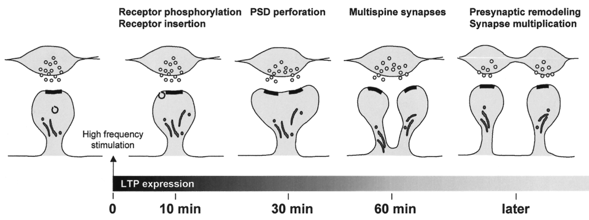{width=400px}

On the other hand LTD works as follows, note that NMDA receptors are required:

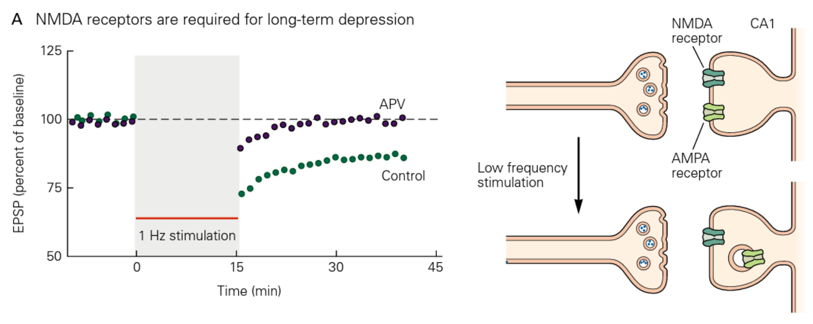{width=400px}

The role of calcium in LTP / LTD:

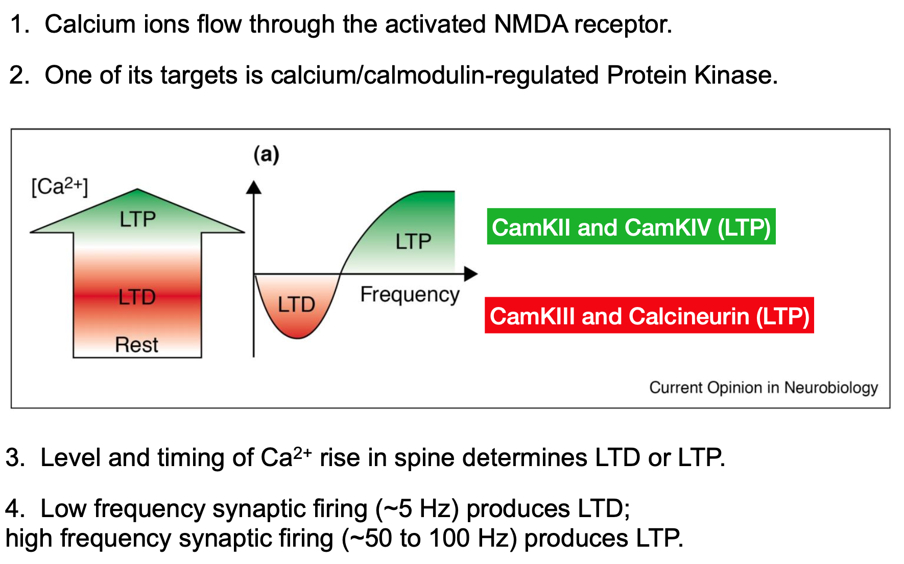{width=400px}

This synaptic plasticity is the main idea of Hebbian learning. 

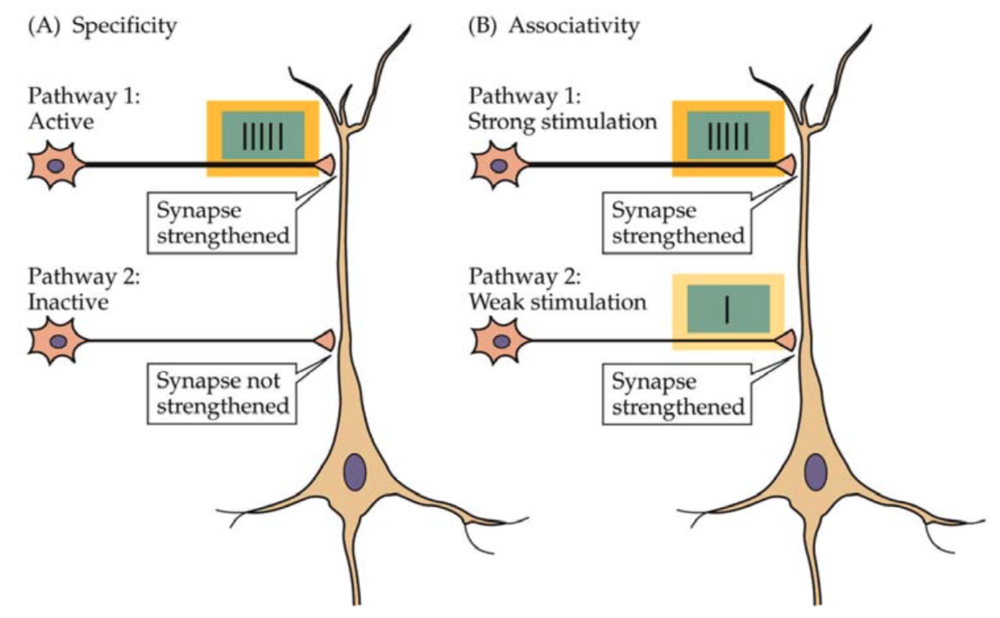{width=400px}

# McCulloch-Pitts Neuron
During the part about learning and plasticity, we already saw the perceptron. Another name for this is the **McCulloch & Pitts Neuron** (can be used interchangeably with perceptron in this section). Such a neuron consists of $x_1, ..., x_n$ inputs that each have a weight $w_1, ..., w_n$, additionally there is a bias $b$. When the summation of these reaches a certain threshold $\theta$ the neuron turns on *(we always talk about 0 as off and 1 as on)*. 

{width=400px}

Our basic model often works with a threshold of $\theta = 1$, meaning the neuron is on if the summation is $\geq 1$ and off is the summation is $< 1$ 

A Perceptron can implement a ***linear decision boundary*** (imagine a line in 2D space), but it can not implement non linear decision boundaries (for example a circle). With such neurons, we can compute some basic functions like AND, OR, NOT. But we have already stated that there are unsolvable problems (example XOR).

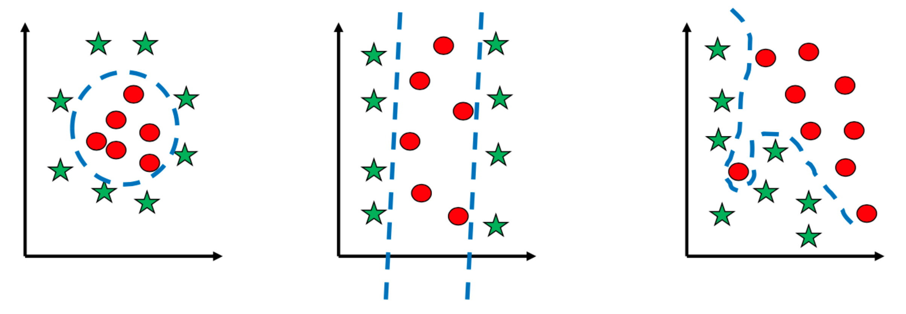{width=400px}

## Perceptron Learning Algorithm
We want to find a way to automatically find the weights. This method exists and is called the **Perceptron Learning Algorithm**.

```python
# Perceptron Learning Algorithm
# -----------------------------

P <- inputs with label 1
N <- inputs with label 0

# Initialize the weights w = {w_1, ..., w_n, w_b}
Initialize the weights w randomly 

# Try all input patterns x = {x_1, ..., x_n, b} and if they 
# give the wrong output adjust the weights.
while not convergence do:
	Pick random x in (P u N)
	
	if x in P and output(x, w) < 0:
		w = w + x
	if x in N and output(x, w) >= 0:
		w = w - x
```

Note that the input for the bias is always 1 ($b=1$). This algorithm will always find a solution for solvable problems. We proved this based on these two facts:

- The weight vector has to increase linearly in magnitude in the long run
- The squared magnitude of the weight vector can increase at most linearly

We could plot this and then would see that our algorithm has to terminate after a finite amount of steps.


# Hopfield Network
A **hopfield network** consists of multiple [McCulloch-Pitts Neuron] that are fully connected (all to all). This would be an example of a network with 4 units:

{width=400px}

Hopfield networks serve as **content-addressable ("associative") memory**, therefore providing a model for understanding human memory and hebbian learning. Some basic rules for these type of networks:

- connections are symmetric: $w_{i,j} = w_{j,i} \Rightarrow$ symmetric weight matrix
- no self-weights
- we can use either 0 / 1 or -1 / +1 as outputs (we use 0 / 1)

To get an output, we first need to set the input (initial state) of some of the units and then update the units until we reach a stable state. This stable state will depend on the update order. Note that for asynchronous updates a network will always converge to a stable state! The proof is based on the fact, that the sum of the weights of the active units will always stay the same or increase. 

We can think of all the stable states of a network to be the memory. As the stable states will be close to the initial state.

## Updating
A unit updates how we described it in the part about [McCulloch-Pitts Neuron], but then the question arises how do we proceed if multiple units want to update. We have two different approaches:

- **asynchronous** - only one unit updates at a time, this unit can be randomly picked or there can be a pre-defined order
- **synchronous** - all units update at the same time / in parallel 

>Note that asynchronous updating can be view as a **greedy max-clique algorithm** for 0 / 1 or as **greedy min-cut algorithm** for -1 / +1.

### Synchronous updating
We have seen that a network might not converge to a stable state when we use synchronous updating. We can analyze the network by thinking of it in terms of single-unit updates in a network twice as big.

For this we introduce an intermediary node after each existing node. Therefore in one time-step, the update first propagates to these new node, before it propagates further in the next time-step. In this larger network we update asynchronously and therefore it will converge to a stable state. 

If the original network converges to a stable state, the large network will have the same values for the old and new node. If this is not the case, the original network will converge to a pair of states, where the old nodes are the first state and the new nodes are the second state (the network alternates between them).

## Bias
To include the bias in the network, we can add a new unit that is always on and never gets updated. From there we work with the same rules as before.

## Setting the weights
Given a list of desired stable states, we can set the weight between two units according to their correlation in the listed states. If the are the same we use 1, if the are the opposite of each other we use -1 and if they do not correlate, we use 0 as the weight.


# Boltzmann Machine
A Boltzmann Machine is a probabilistic version of a [Hopfield Network] with -1 / +1 outputs. The structure of the network is the same as a hopfield network, but when we update a unit, we consider the energy of the system. We define the total energy as:
$$E = -\Big(\sum_{i,j} w_{i,j} x_i x_j + \sum_i w_i x_i\Big)$$
The second term represents the biases, while the first term represents the inter-unit connections.

In such a Boltzmann machine the probability of a state $s$ is proportional to $e^{\frac{-E_s}{tk}}$, where $E_s$ is the energy of the state, $t$ is the temperature and $k$ is the Boltzmann's constant. Since we are not interested in the temperature, we can ignore the bottom part of the fraction.

Generally we can say that states with lower energy are preferable and the systems spends more time in such states.

## Updating a unit
Say we are in a given state $s$ and we want to update a unit $k$. We compare the current state with the state that we would enter if we flipped this single unit. Here we assume that we are currently in the positive output state.
$$\frac{P(s_+)}{P(s_+) + P(s_-)} = \frac{e^x}{e^x + 1}$$
where $x = (-2\sum_i w_{k,i} x_i + 2 w_k)/(kt)$.

## State of the system
Now we don't have stable states, the system is always "working". When updating the state, we travel across the state space according to the relative probability. We choose between 2 states based on their relative probability, this is a form of **Gibbs sampling**. The system **converges to the right distribution** (time it spends in each state) in the same way that connecting chambers (2 at a time) will lead to gas reaching equilibrium. 

## Training a Boltzmann machine
With learning, we can learn to approximate a distribution. For this we use the Kullback-Leibler divergence:
$$KL = \sum_s P^*(s) \ln\frac{P^*(s)}{P^n(s)}$$
where $P^*$ is the true distribution and $P^n$ is the machine's distribution. This divergence is 0 if the two distributions match. To update the weights to get our machine closer to the distribution we want, we use gradient descent, where we update like this:
$$w_{i,j} \text{ += } \alpha (E[x_i x_j]_* - E[x_i x_j]_n)$$
$$w_i \text{ += } \alpha (E[x_i]_* - E[x_i]_n)$$
The first term corresponds to Hebbian learning, while the second term is anti Hebbian learning. The first term is useful for learning while the second one destroys the bad learning. This is also called a **Wake / Sleep** algorithm. 

>In reality Boltzmann machines are very slow to learn and therefore they do not get used.

There are some approaches to make the Boltzmann machine faster: 

- Restricted Boltzmann machine - we split the units into input and internal in the form of a bipartite graph
- Mean-field approximation - deterministic system with real-valued output (expected value of output)


# Population Codes
In [The Neural Code] we discussed the fact that neurons are tuned to a specific value of a stimulus. Meaning that their response is strongest if the stimulus matches their tuning. An example would be the angle of a line at a location on the retina.

The **population code** is the response of all the neurons for a give value of a stimulus. Example all the responses of the neurons for a line with an angle of $60^o$. This approach allows us to easily decode the stimulus value as it is very robust to noise.

Now the question arises how neurons can compute with this form of encoded information. We discussed the following example:

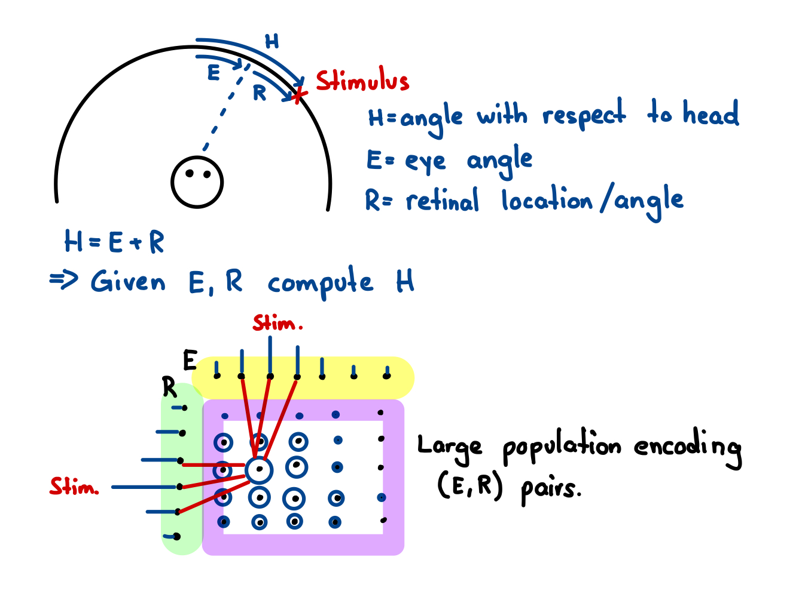{width=400px}

Here we can interpret a diagonal of the population matrix as a defined value for $H$. Now how does the neuronal system find $H$? This is simple, it connects all the neurons of the diagram to a value of $H$. We can modify this example to find any value for $E, R, H$ and to work for spherical angles.

In the end this population encodes the relation between $E, R, H$ and these connections can be learned via **Hebbian learning**. These relations can be expanded to larger systems (by connecting smaller subsystems).

## Threshold-based sensory neurons
Instead of neurons that are value based, there are also threshold-based neurons. These neurons are active, if the stimulus reaches a certain threshold. For such neuronal systems, the same property holds, it is easy to decode the stimulus value as the system is very robust to noise.

We can convert from one system to the other: 

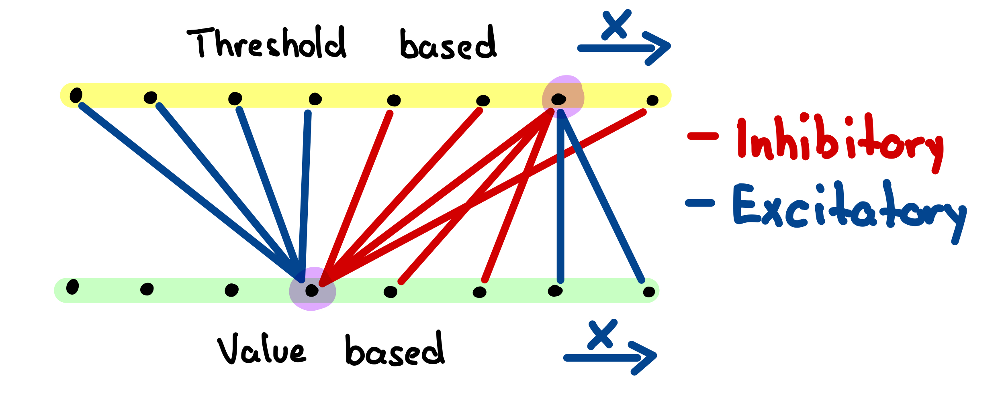{width=400px}

## The Aperture Problem
It is often simpler for a neuron to only compute the time derivative of light intensity. This reduces the "data throughput" needed. But this introduces a new problem, locally, we cannot detect the direction of motion. The motion appears to, locally, be perpendicular to the spatial gradient of the light intensity. To find the motion, we need a complex system. We can describe this by the **optic flow equation**:
$$V = -\vec{F} \cdot \vec{G}$$
Using a population we can represent this equation and it's subsystems. 
 
 
# Neuromorphic Engineering
The term neuromorphic was coined by Carver Mead in the late ’80s to describe VLSI systems containing electronic analog/digital circuits that exploit the physics of silicon to reproduce the bio-physics of neural circuits present in the nervous system.

We can characterize the goal of neuromorphic engineering in two main goal:

- understand the computational properties of biological neural systems using CMOS VLSI technology
- exploit the known properties of biological systems to design and implement efficient devices

## Neuromorphic computing
Neuromorphic computing is a radical paradigm shift: 

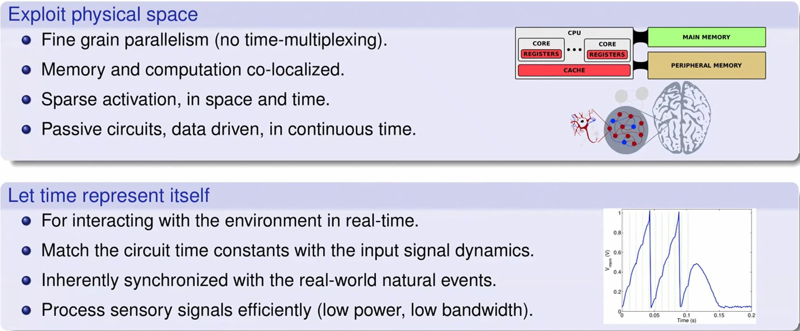{width=400px}

## Neuromorphic electronic circuits
These circuits use transistors in their analog domain (discrete) to emulate the ion channels. If the transistor is operated in sub-threshold areas, the gate voltage has to be increased. Remember the transistor types:

- p-FET - will conduct with no voltage applied
- n-FET - will conduct when voltage is applied

In the lecture it was showed how we can build some basic circuits.